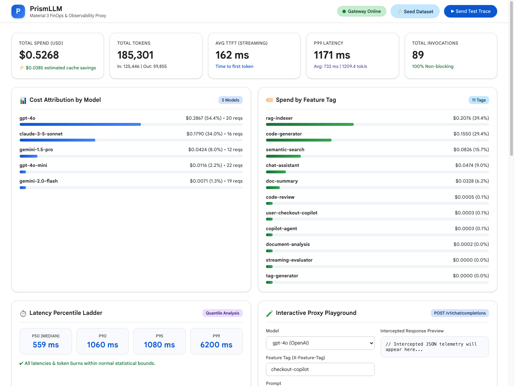
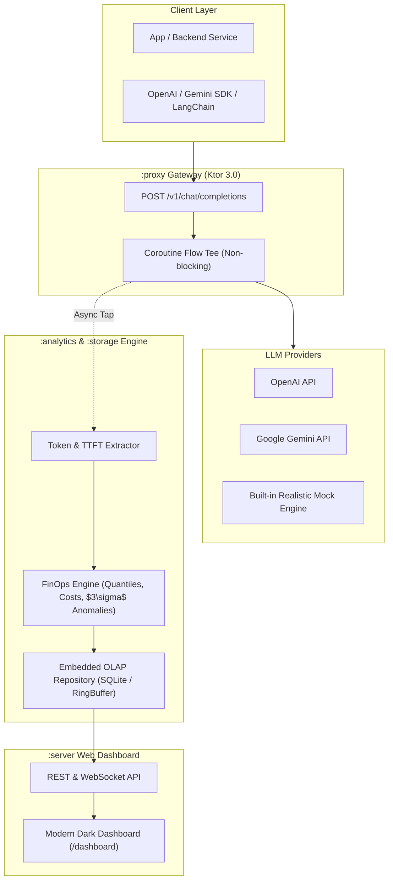

# 🔮 PrismLLM — High-Performance LLM FinOps & Observability Proxy

[](https://kotlinlang.org)
[](https://openjdk.org)
[](https://gradle.org)
[](https://ktor.io)
[](https://opensource.org/licenses/MIT)

> **A drop-in reverse proxy gateway engineered in Kotlin for monitoring, attributing, and optimizing token spend, latency (TTFT/p99), and throughput across LLM provider calls (OpenAI, Gemini, Anthropic).**

---

## 🌟 Why PrismLLM?

As engineering teams integrate generative AI into production, they face three critical challenges:
1. **Runaway Token Costs:** Lack of granular attribution per user, tenant, or product feature.
2. **Streaming Latency Spikes:** High Time-To-First-Token (TTFT) and tail latency degradation ($p95/p99$) impacting user experience.
3. **Black Box Invocations:** Inability to inspect prompt sizes, completion ratios, and cache leverage without adding heavy latency to client calls.

**PrismLLM** solves this by sitting between your applications and LLM providers. Using **Kotlin Coroutines and Flow**, it taps into request/response streams non-blockingly, aggregates analytical rollups, and serves a modern Material 3 FinOps dashboard.

---

## 📸 Material 3 Dashboard Preview



---

## 🏛️ System Architecture



---

## ✨ Key Features

* **⚡ Non-Blocking Stream Interception:** Uses Kotlin Coroutine `Flow` teeing to inspect SSE token chunks with zero perceptible latency added to the client.
* **💰 Granular Cost Attribution:** Tracks spend and token consumption by **Model**, **Feature Tag** (`X-Feature-Tag`), and **User/Tenant ID** (`X-User-Id`).
* **⏱️ Latency Percentile Ladder:** Computes real-time $p50, p90, p95, p99$ response times and Time-To-First-Token (TTFT).
* **🚨 Statistical Anomaly Detection:** Flags runaway prompt loops or abnormal token burn rates ($> \mu + 3\sigma$).
* **💡 Prompt Caching Opportunity Estimator:** Analyzes prompt prefix repetition to quantify potential monthly savings from prompt caching.
* **🖥️ Embedded Modern Dark-Mode Dashboard:** Responsive glassmorphism web UI served directly at `/dashboard` with zero external frontend build dependencies.
* **🧪 Zero-Credential Mock & Simulator Mode:** Includes an integrated LLM simulator so the repository can be tested end-to-end immediately without requiring paid API keys.

---

## 📂 Multi-Module Architecture

PrismLLM is structured into decoupled Gradle subprojects:

| Module | Purpose |
| :--- | :--- |
| **`:core`** | Pure domain contracts, token telemetry data classes, and dynamic `PricingRegistry`. |
| **`:analytics`** | Statistical calculations, quantile ladder ($p50-p99$), moving average anomaly detectors. |
| **`:storage`** | Embedded OLAP persistence (`SqliteTraceRepository`) and sub-millisecond ring buffers. |
| **`:proxy`** | Ktor HTTP reverse proxy interceptor, streaming SSE taps, and mock fallback service. |
| **`:server`** | Application bootstrap, REST/WebSocket routes, and embedded HTML5 dashboard. |

---

## 🚀 Quick Start

### 1. Prerequisites
* **Java 21** or later (e.g. OpenJDK 21)
* **Git**

### 2. Clone & Run Locally
```bash
git clone https://github.com/<your-username>/prism-llm.git
cd prism-llm

# Run with Gradle
./gradlew run
```

Once started, open your browser at:
👉 **`http://localhost:8080/dashboard`**

---

### 3. Send a Request Through the Proxy

PrismLLM is a drop-in replacement for OpenAI endpoints. You can point any SDK or cURL request directly to it:

#### Standard cURL Request:
```bash
curl -X POST http://localhost:8080/v1/chat/completions \
  -H "Content-Type: application/json" \
  -H "X-Feature-Tag: payment-assistant" \
  -H "X-User-Id: customer_4821" \
  -d '{
    "model": "gpt-4o",
    "messages": [
      {"role": "user", "content": "Explain how distributed locks work in Kotlin."}
    ],
    "stream": false
  }'
```

#### Streaming SSE Request:
```bash
curl -N -X POST http://localhost:8080/v1/chat/completions \
  -H "Content-Type: application/json" \
  -H "X-Feature-Tag: live-terminal" \
  -d '{
    "model": "gemini-2.0-flash",
    "messages": [
      {"role": "user", "content": "Stream a quick summary."}
    ],
    "stream": true
  }'
```

Watch the dashboard at `http://localhost:8080/dashboard` immediately reflect the tokens, latency, and cost attribution in real time!

---

### 4. Integration with Python / TypeScript SDKs

#### Python (OpenAI SDK):
```python
from openai import OpenAI

client = OpenAI(
    base_url="http://localhost:8080/v1",
    api_key="mock-key-or-real-key",
    default_headers={
        "X-Feature-Tag": "rag-pipeline",
        "X-User-Id": "tenant-corp-99"
    }
)

response = client.chat.completions.create(
    model="gpt-4o",
    messages=[{"role": "user", "content": "Hello PrismLLM!"}]
)
print(response.choices[0].message.content)
```

---

## 🐳 Docker Deployment

Run PrismLLM as a lightweight containerized service:

```bash
docker compose up --build
```

---

## 🧪 Testing & Verification

Run the comprehensive test suite across all modules:

```bash
./gradlew test --info
```

Build the standalone executable Fat-JAR:

```bash
./gradlew shadowJar
# Run standalone
java -jar server/build/libs/prism-llm-server-1.0.0-all.jar
```

---

## 📄 License

This project is licensed under the [MIT License](LICENSE).
